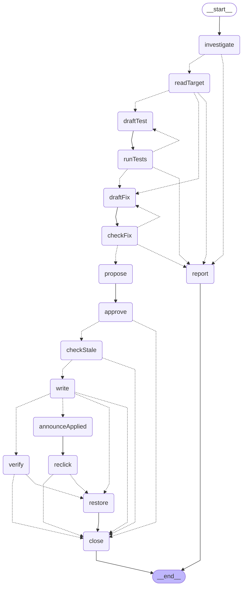

# The LangGraph engine

Generated from `graph.mjs` by `node scripts/graph-diagram.mjs`. Don't edit it by hand.

```mermaid
%%{init: {'flowchart': {'curve': 'linear'}}}%%
graph TD;
	__start__([<p>__start__</p>]):::first
	investigate(investigate)
	readTarget(readTarget)
	draftTest(draftTest)
	runTests(runTests)
	draftFix(draftFix)
	checkFix(checkFix)
	propose(propose)
	approve(approve)
	checkStale(checkStale)
	write(write)
	verify(verify)
	announceApplied(announceApplied)
	reclick(reclick)
	restore(restore)
	close(close)
	report(report)
	__end__([<p>__end__</p>]):::last
	__start__ --> investigate;
	announceApplied --> reclick;
	close --> __end__;
	draftFix --> checkFix;
	draftTest --> runTests;
	propose --> approve;
	report --> __end__;
	restore --> close;
	investigate -.-> readTarget;
	investigate -.-> report;
	readTarget -.-> draftTest;
	readTarget -.-> draftFix;
	readTarget -.-> report;
	runTests -.-> draftTest;
	runTests -.-> draftFix;
	runTests -.-> report;
	checkFix -.-> draftFix;
	checkFix -.-> propose;
	checkFix -.-> report;
	approve -.-> checkStale;
	approve -.-> close;
	checkStale -.-> write;
	checkStale -.-> close;
	write -.-> verify;
	write -.-> announceApplied;
	write -.-> restore;
	write -.-> close;
	verify -.-> close;
	verify -.-> restore;
	reclick -.-> close;
	reclick -.-> restore;
	classDef default fill:#f2f0ff,line-height:1.2;
	classDef first fill-opacity:0;
	classDef last fill:#bfb6fc;

```
